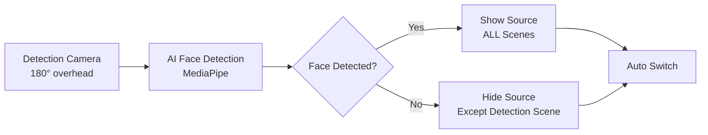

# FS Source 🎥

<div align="center">

**Automatically show/hide OBS sources when you face the camera**  
*Zero hotkeys. Zero green screens. Pure automation.*

[](https://www.python.org)
[](https://obsproject.com)
[](LICENSE)
[](https://twitch.tv/ChefJayTay)

Perfect for cooking & maker streams, tutorials, product demos, or any stream where you want sources to appear when you look at the camera.

---

</div>

## ✨ What It Does

**You look at camera → Your chosen source appears across ALL scenes**  
**You look away → Source disappears (except in your monitoring scene)**

### 🎬 Real-World Example
You're cooking and have an overhead 180° camera watching you. When you look up to talk to chat, your face camera automatically appears. Look back down at your work, it disappears. No buttons, no switching scenes, completely automatic.

<div align="center">

| 👀 Face Detected | 🙈 No Face |
|:---:|:---:|
| Face camera **visible** | Face camera **hidden** |
| Automatic switch | Automatic revert |

</div>

---

## 🚀 Key Features

<table>
<tr>
<td width="50%">

### 🌍 Global Control
- **Works across ALL scenes** simultaneously
- Switch scenes freely - automation follows you
- Smart exclusions for detection scenes

</td>
<td width="50%">

### ⚡ Performance
- **~50-200ms** response time
- AI-powered face detection
- Network capable for remote monitoring

</td>
</tr>
<tr>
<td width="50%">

### 🎮 Three Operating Modes
- **Remote**: NDI/network sources
- **Daemon**: Always-on with smart standby
- **Native**: Direct USB camera (lowest latency)

</td>
<td width="50%">

### 🛠️ Easy Setup
- Interactive configuration wizard
- Connection testing tools
- Comprehensive documentation

</td>
</tr>
</table>

---

## 📦 Quick Start

### 1️⃣ Install

```bash
git clone https://github.com/chefjaytay/fs-source.git
cd fs-source
python3 -m venv venv
source venv/bin/activate  # On Windows: venv\Scripts\activate
pip install -r requirements.txt
```

### 2️⃣ Enable OBS WebSocket

OBS Studio → **Tools** → **WebSocket Server Settings** → **Enable**

### 3️⃣ Configure

```bash
python setup.py  # Interactive setup wizard
```

### 4️⃣ Run

```bash
./run.sh           # Remote mode (NDI/network sources)
./run_daemon.sh    # Always-on daemon mode
./run_native.sh    # Native mode (local USB camera)
```

---

## 🎯 Use Cases

<table>
<tr>
<td>

### 👨‍🍳 Cooking Streams
Overhead camera watches you cook. Face camera pops up when you look up to engage with chat.

</td>
<td>

### 🎓 Tutorials
Switch between demo camera and face camera automatically based on where you're looking.

</td>
</tr>
<tr>
<td>

### 📦 Product Demos
GoPro angle appears when you face main camera to show details.

</td>
<td>

### 🔒 Privacy Control
Hide screen capture automatically when you're on camera.

</td>
</tr>
</table>

---

## 🔧 How It Works



### Global Scene Control
Unlike traditional OBS automation that only works in one scene, FS Source controls source visibility **across all your scenes**. Switch scenes freely - the automation follows you.

---

## 🎮 Operating Modes

| Mode | Best For | Latency | Features |
|------|----------|---------|----------|
| 🌐 **Remote** | NDI cameras, network streams | ~200ms | Multi-machine support, network monitoring |
| 🤖 **Daemon** | Production streams, 24/7 | ~100ms | Always-on, smart standby, auto-recovery |
| 🎥 **Native** | Local USB webcams | ~50ms | Direct camera access, lowest latency |


---

## 🧪 Testing Tools

```bash
# Test OBS connection and see all sources
python test_obs_connection.py

# Find local cameras (for native mode)
python test_local_camera.py

# Test face detection
python test_camera.py
```

---

## ⚙️ Configuration Example

```json
{
    "obs_host": "localhost",
    "obs_port": 4455,
    "obs_password": "your_password",
    
    "monitor_source_name": "180 Camera",
    "detection_scene_name": "Detection",
    "show_source_name": "Face Camera",
    
    "face_detection_confidence": 0.7,
    "check_interval": 0.5
}
```

---

## 🎁 Support the Project

If FS Source has improved your streaming workflow, consider supporting its development!

<div align="center">

### 💜 Support on Twitch
Follow, Subscribe, Gift Subs, and see FS Source in action

[](https://twitch.tv/ChefJayTay)

### 🎉 Support via StreamElements
Donate, or just say thanks!

[](https://streamelements.com/chefjaytay-6052/tip)


---

**Every bit of support helps keep this project active and improving!**

⭐ **Star this repo** if you find it useful  
🐛 **Report bugs** to help improve it  
📢 **Share** with other streamers

</div>

---

## 💡 Advanced Features

- **System Service** - Auto-start at boot with `./install_service.sh` (Linux)
- **Remote Monitoring** - Monitor OBS over your local network
- **Multiple Sources** - Control multiple show/hide sources simultaneously
- **Adjustable Sensitivity** - Tune detection for your lighting and setup
- **Preview Window** - Debug mode with visual feedback

---

## 🔍 Troubleshooting

<details>
<summary><b>Can't connect to OBS?</b></summary>

- Check WebSocket is enabled in OBS Tools menu
- Verify password matches configuration
- Try default port 4455
- Run `python test_obs_connection.py`
</details>

<details>
<summary><b>Source not found?</b></summary>

- Source names are **case-sensitive**
- Run `python test_obs_connection.py` to see exact names
- Check source exists in at least one scene
</details>

<details>
<summary><b>Face detection not working?</b></summary>

- Lower `face_detection_confidence` to 0.5-0.6
- Ensure good lighting on your face
- Test with `python test_camera.py`
- Check camera is accessible to the system
</details>

---

## 🛠️ Requirements

- Python 3.8+
- OBS Studio 28+ with WebSocket plugin
- Camera/video source accessible to OBS
- Linux, macOS, or Windows

### Python Dependencies
All dependencies install automatically via `requirements.txt`:
- opencv-python
- mediapipe
- obs-websocket-py
- numpy
- Pillow

---

## 🤝 Contributing

Contributions are welcome! Whether it's:

- 🐛 Bug reports
- 💡 Feature requests  
- 📝 Documentation improvements
- 💻 Code contributions

Please open an issue or pull request on GitHub.

---

## 📜 License

MIT License - see [LICENSE](LICENSE) file for details

---

## 🙏 Credits

- Face detection powered by [Google MediaPipe](https://google.github.io/mediapipe/)
- OBS integration via [obs-websocket-py](https://github.com/Elektordi/obs-websocket-py)
- Built by streamers, for streamers

---

<div align="center">

### 🌟 Star History

If you find this project useful, give it a star to show your support!

**Made with ❤️ for the streaming community**

[⬆ Back to Top](#fs-source-)

</div>